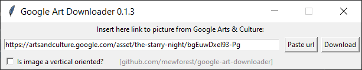

# Google Art Downloader 

This utility allows you to save all of the images from [Google Art Project](https://artsandculture.google.com) in high quality (up to 4K). 

## Status of project

Google art downloader will receive minor updates and support in issues section.

## Using utility
Just download [google-art-downloader.zip](https://github.com/mewforest/google-art-downloader/releases/download/v0.1.2-beta/google-art-downloader-0-1-2.zip) from [releases](https://github.com/mewforest/google-art-downloader/releases), unzip it to any folder and run **google-art-downloader.exe**. Then insert link to the text field using `CTRL+V` or button **"Paste url"** (yes, you can delete example link), click **"Download"** and wait until the image is ready.

## Dependencies
Compiled release requires just connection to the Internet and Chrome installed (added in PATH).

Source code has written in Python 3.6 and has the following dependencies: Selenium, Pillow (PIL).

## Issues

If you'll get error on specific page, please contact me on github with information:
1. What the version do you have of Google Chrome? Chromedriver needs Google Chrome installed.
2. Which version of the GAD are you running (compiled or source code)?
3. What the OS are you using? Sometimes Chromedriver doesn't working properly on Windows 7 and older.
4. On which step program stops?
5. Hyperlink to an image on Google Arts & Culture.

## Alternatives
If you are interested in more highest image resolution or Selenium webdriver isn't starting well, you could use alternatives:
- [dezoomify](https://ophir.alwaysdata.net/dezoomify/dezoomify.html) (works online),
- [dezoomify-rs](https://github.com/lovasoa/dezoomify-rs) (a command-line application for windows, linux and macos),
- or [gapdecoder](https://github.com/gap-decoder/gapdecoder) (a python script) instead.

*Thanks to [@lovasoa](https://github.com/lovasoa) for contributing.*